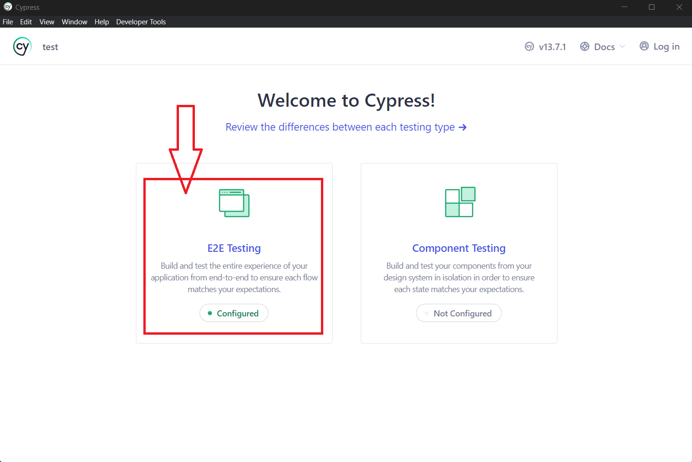
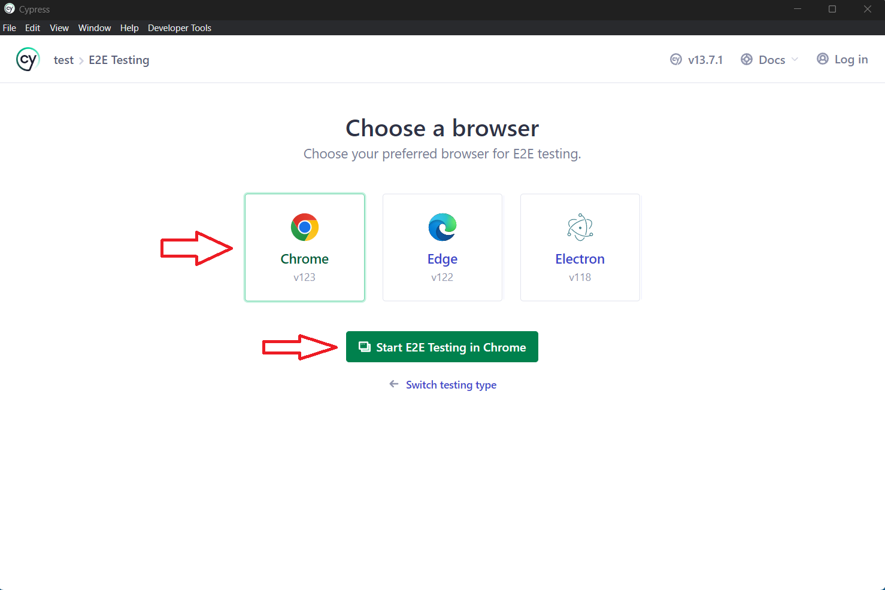
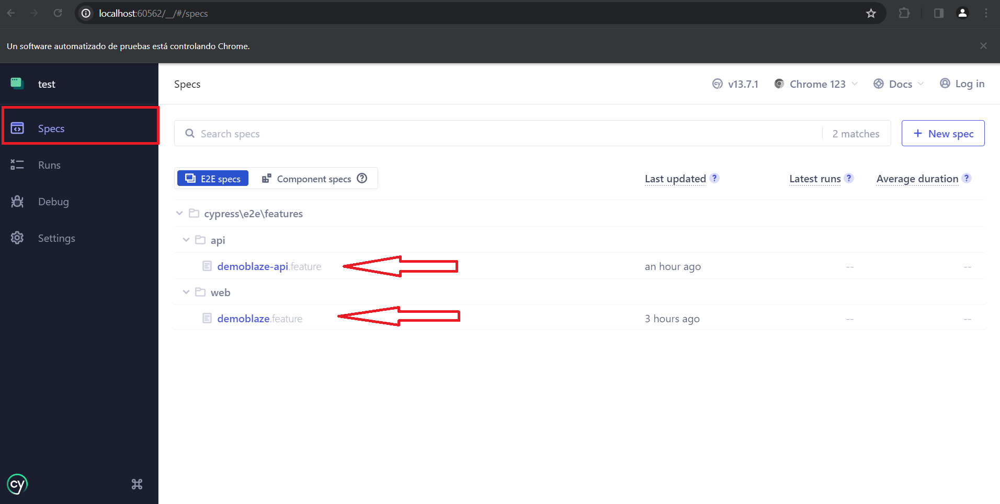

# Demoblaze Cypress Automation

Este es un ejemplo para al automatización E2E y API de la web [Demoblaze](https://www.demoblaze.com)

Tanto E2E como API están en el mismo proyecto

## Instalar Dependencias

```bash
npm install
```

## Run Cypress

Ejecutar cypress run de cualquiera de las 2 formas


```bash
npm run cypress:chrome
```

## Run Cypress: modo interactivo

Tener en cuenta que en este modo no se generará el reporte

```bash
npm run cypress:open
```

Una vez abierto seleccionar el tipo de test, en nuestro caso "E2E Testing"



Luego seleccionar el navegador("Chrome") e iniciar



Y para ejecutar nuestros features tan solo seleccionamos el feature a visualizar dentro de la opción de Specs



# Estructura de directorios

    .
    ├── cypress
    │   ├── ...
    │   ├── e2e 
    │   │   ├── features                         # Features  
    │   │   │   ├── api
    │   │   │   └── web
    │   │   └── stepDefinitions                  # Step defitions
    │   │       ├── api                             
    │   │       └── web    
    │   └── ...
    ├── img                                      # Archivos img para readme
    ├── .cypress-cucumber-preprocessorrc.json    # Cypress-cucumber conf
    ├── cucumber-reports.html                    # HTML Report
    ├── cucumber-reports.json                    # JSON Report
    ├── cypress.config.js                        # Cypress Conf
    ├── package.json                             # html principal
    └── readme.md